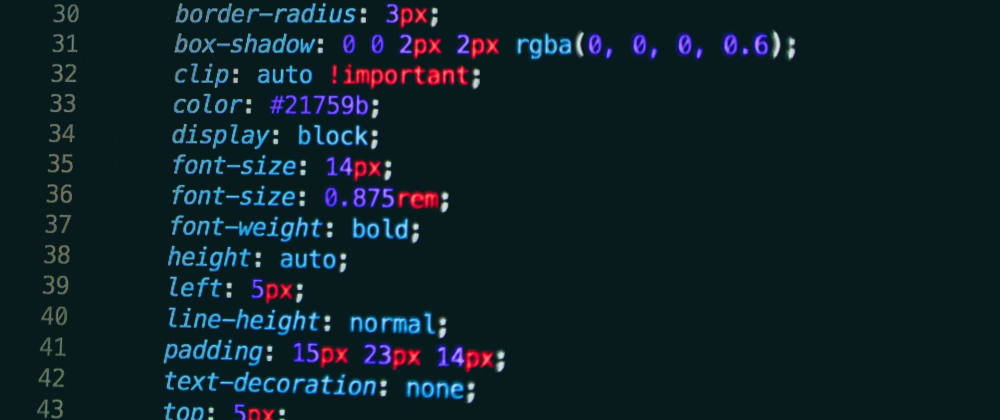

# Links
**how it is writing ?**
`<a href = "thel link we are going to ">Name that show on page</a>`

1.Linking to Other Sites the attribute a is href , have absolute URL in this case . Note :Browsers show links in blue with an underline

2.by default.

Linking to Other Pages on the Same Site the attribute a is href , have relative URL in this case ; like file name has extinsion .html

**Directory Structure**

if we have big websites , many pages , should organize all of it in the code , every page have folder (directories)

3.Relative URLs shorthand telling the browser where to find your files.

`Relative link type`
Same Folder (use file name only ). Child Folder (folder name /file.html) Grandchild Folder (child folder name /grandchild folder/file.html) GrandParent Folder (../../file.html)

4.Email Links
`<a href = " mailto : mmmm@yahoo.com">Email name </a>`

5.Opening Links in a New Window
`<a href="http://www.imdb.com" target="_blank">Internet Movie Database</a>`

6.Linking to a Specific Part of the Same Page
using `id="IdName" <a href="#IdName" >Name show in window</a>`

# layout
Containing Elements
if we have block in block , tha bigest one calls the containing or parent element.

Controll ing the Position of Elements

1.Normal flow (vertical down )
2.Relative Positioning (keep Normal flow)
3.absolute Positioning (no Normal flow)
4.Fixed Positioning (Relative to the window)
5.Floating element (no normal flow )

 **Overlapping elements z-index**
the element have greater value of z is appear at the top.

 **float elements**
make elements in the same contener but in the left or right. we can use it to show elemment side by side

**Screen Sizes and Resolution**
(number of dots a screen shows per inch) we should design 960-1000 pixels wide

rember to :Grids help create professional and flexible designs.

## Functions, Methods, and Objects
*Functions and Methods* : series of statement to do some tasks. we can save it alone and call it when we want it
ceclaring a Function
function NameOfFuncion(){ statment ; } NameOfFuncion (3,5) --- this have arguments to use we can use arry with fun. local and global var. to valid lose it

